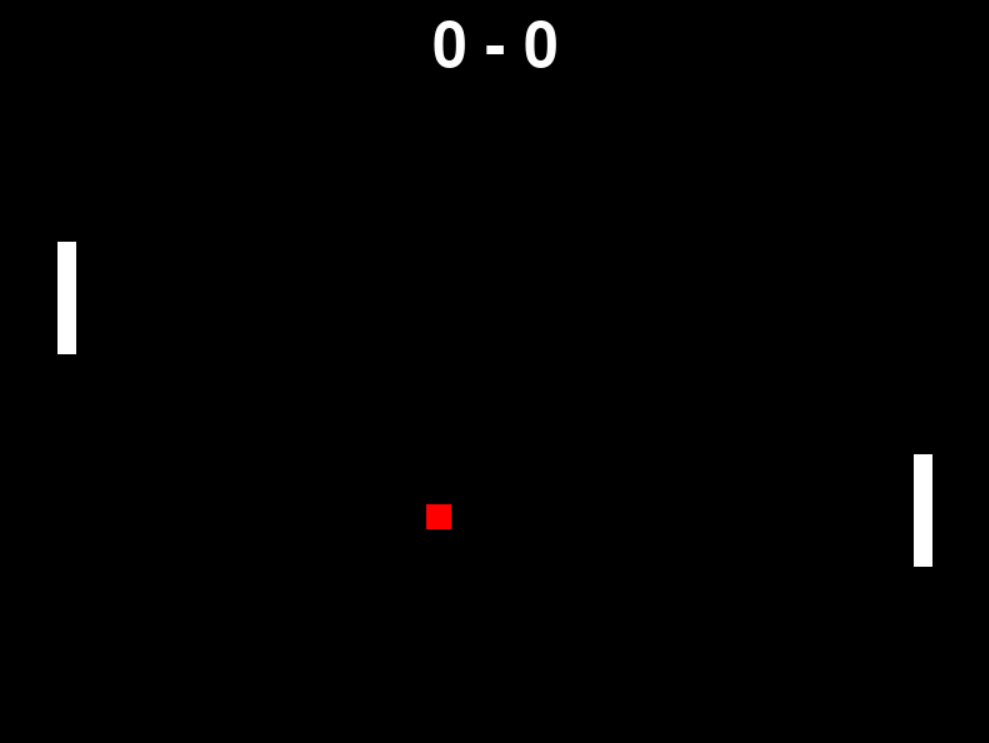

# Pong

A classic Pong game built with Python and Pygame.



## Features

- Single-player vs Computer opponent
- Score tracking
- Retro pixel visuals
- Simple keyboard controls

## Requirements

- Python 3.8+
- Pygame 2.5+

## Controls

| Key | Action |
|-----|--------|
| `W` | Move up |
| `S` | Move down |

## Installation

```bash
git clone https://github.com/emre-44/pong-game.git
cd pong-game
pip install -r requirements.txt
```
## Run

```bash
python pong.py
```